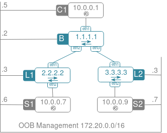

# kubernetes-on-eos
Kubernetes ported to Arista EOS

# Build

[Build Instructions](build.md)

# Build test topology

```
docker-topo --create k8s.yml 
```




# Generate certificates

```
host-c1
sudo su
apk add --no-cache curl openssh
ip route add 1.1.1.1 via 10.0.0.0
ip route add 2.2.2.2 via 10.0.0.0
ip route add 3.3.3.3 via 10.0.0.0
curl -o cfssl https://pkg.cfssl.org/R1.2/cfssl_linux-amd64
curl -o cfssljson https://pkg.cfssl.org/R1.2/cfssljson_linux-amd64
chmod +x cfssl cfssljson
sudo mv cfssl cfssljson /usr/local/bin/

mkdir k8s && cd k8s
```
* CA configuration file
```
cat > ca-config.json <<EOF
{
  "signing": {
    "default": {
      "expiry": "26280h"
    },
    "profiles": {
      "kubernetes": {
        "usages": ["signing", "key encipherment", "server auth", "client auth"],
        "expiry": "26280h"
      }
    }
  }
}
EOF
```
* CA request
```
cat > ca-csr.json <<EOF
{
  "CN": "Kubernetes",
  "key": {
    "algo": "rsa",
    "size": 2048
  },
  "names": [
    {
      "C": "UK",
      "L": "London",
      "O": "Kubernetes",
      "OU": "CA"
    }
  ]
}
EOF
```
## Certificate setup

### Generate certs
```
cfssl gencert -initca ca-csr.json | cfssljson -bare ca
```
* Admin client CSR
```
cat > admin-csr.json <<EOF
{
  "CN": "admin",
  "key": {
    "algo": "rsa",
    "size": 2048
  },
  "names": [
    {
      "C": "UK",
      "L": "London",
      "O": "system:masters",
      "OU": "Kubernetes"
    }
  ]
}
EOF
```
* Generate admin client certificate + key
```
cfssl gencert \
  -ca=ca.pem \
  -ca-key=ca-key.pem \
  -config=ca-config.json \
  -profile=kubernetes \
  admin-csr.json | cfssljson -bare admin
```
* kubelet certificates
```
for instance in veos-l1 veos-l2 veos-b; do
cat > ${instance}-csr.json <<EOF
{
  "CN": "system:node:${instance}",
  "key": {
    "algo": "rsa",
    "size": 2048
  },
  "names": [
    {
      "C": "UK",
      "L": "London",
      "O": "system:nodes",
      "OU": "Kubernetes"
    }
  ]
}
EOF

IP=`getent hosts veos-b | awk '{print $1}'`

cfssl gencert \
  -ca=ca.pem \
  -ca-key=ca-key.pem \
  -config=ca-config.json \
  -hostname=${instance},$IP \
  -profile=kubernetes \
  ${instance}-csr.json | cfssljson -bare ${instance}
done
```
* kube-proxy CSR
```
cat > kube-proxy-csr.json <<EOF
{
  "CN": "system:kube-proxy",
  "key": {
    "algo": "rsa",
    "size": 2048
  },
  "names": [
    {
      "C": "UK",
      "L": "London",
      "O": "system:node-proxier",
      "OU": "Kubernetes"
    }
  ]
}
EOF
```
* kube-proxy cert
```
cfssl gencert \
  -ca=ca.pem \
  -ca-key=ca-key.pem \
  -config=ca-config.json \
  -profile=kubernetes \
  kube-proxy-csr.json | cfssljson -bare kube-proxy
```
* API server CSR
```
cat > kubernetes-csr.json <<EOF
{
  "CN": "kubernetes",
  "key": {
    "algo": "rsa",
    "size": 2048
  },
  "names": [
    {
      "C": "UK",
      "L": "London",
      "O": "Kubernetes",
      "OU": "Kubernetes"
    }
  ]
}
EOF
```
* API  server certs
```
cfssl gencert \
  -ca=ca.pem \
  -ca-key=ca-key.pem \
  -config=ca-config.json \
  -hostname=1.1.1.1,10.10.0.1,127.0.0.1,kubernetes.default \
  -profile=kubernetes \
  kubernetes-csr.json | cfssljson -bare kubernetes
```
### Distribute certs
```
for instance in veos-b veos-l1 veos-l2; do
ssh -t admin@$instance "mkdir k8s"
done
```
* to master node
```
for instance in veos-b; do
scp ca.pem ca-key.pem kubernetes-key.pem kubernetes.pem admin@$instance:/mnt/flash/k8s/
done
```
* to worker nodes
```
for instance in veos-b veos-l1 veos-l2; do
scp ca.pem ${instance}-key.pem ${instance}.pem admin@$instance:/mnt/flash/k8s/
done
```
## KUBECONFIG FILES

Upload kubectl binaries to to host-c1
```
scp admin@172.20.0.2:/home/kubernetes-on-eos/bin/kubectl .
export PATH=$PATH:$(pwd)
```
* for worker nodes
```
for instance in veos-b veos-l1 veos-l2; do
  kubectl config set-cluster kubernetes \
    --certificate-authority=ca.pem \
    --embed-certs=true \
    --server=https://1.1.1.1:6443 \
    --kubeconfig=${instance}.kubeconfig

  kubectl config set-credentials system:node:${instance} \
    --client-certificate=${instance}.pem \
    --client-key=${instance}-key.pem \
    --embed-certs=true \
    --kubeconfig=${instance}.kubeconfig

  kubectl config set-context default \
    --cluster=kubernetes \
    --user=system:node:${instance} \
    --kubeconfig=${instance}.kubeconfig

  kubectl config use-context default --kubeconfig=${instance}.kubeconfig
done
```
* for kube-proxy
```
kubectl config set-cluster kubernetes \
  --certificate-authority=ca.pem \
  --embed-certs=true \
  --server=https://1.1.1.1:6443 \
  --kubeconfig=kube-proxy.kubeconfig
kubectl config set-credentials kube-proxy \
  --client-certificate=kube-proxy.pem \
  --client-key=kube-proxy-key.pem \
  --embed-certs=true \
  --kubeconfig=kube-proxy.kubeconfig
kubectl config set-context default \
  --cluster=kubernetes \
  --user=kube-proxy \
  --kubeconfig=kube-proxy.kubeconfig
kubectl config use-context default --kubeconfig=kube-proxy.kubeconfig
```
* distribute 
```
for instance in veos-b veos-l1 veos-l2; do
  scp ${instance}.kubeconfig kube-proxy.kubeconfig admin@$instance:/mnt/flash/k8s/
done
```
## Secret data encryption
```
ENCRYPTION_KEY=`head -c 32 /dev/urandom | base64`

cat > encryption-config.yaml <<EOF
kind: EncryptionConfig
apiVersion: v1
resources:
  - resources:
      - secrets
    providers:
      - aescbc:
          keys:
            - name: key
              secret: ${ENCRYPTION_KEY}
      - identity: {}
EOF
```
* distribute to master
```
for instance in veos-b; do
    scp encryption-config.yaml admin@$instance:/mnt/flash/k8s/
done
```

## Bootstrapping ETCD cluster (single node)

login veos-b

```
cd /mnt/flash/k8s/
sudo su
echo """
1.1.1.1 veos-b
2.2.2.2 veos-l1
3.3.3.3 veos-l2
""" >> /etc/hosts


mkdir -p etc/etcd var/lib/etcd
cp ca.pem kubernetes-key.pem kubernetes.pem etc/etcd/
ETCD_NAME=`hostname -s`
IP=1.1.1.1
export PATH=$PATH:$(pwd)
```

```
cat > etcd.service <<EOF
[Unit]
Description=etcd
Documentation=https://github.com/coreos

[Service]
Environment=ETCD_UNSUPPORTED_ARCH=386
ExecStart=/mnt/flash/k8s/etcd \\
  --name ${ETCD_NAME} \\
  --cert-file=/mnt/flash/k8s/etc/etcd/kubernetes.pem \\
  --key-file=/mnt/flash/k8s/etc/etcd/kubernetes-key.pem \\
  --peer-cert-file=/mnt/flash/k8s/etc/etcd/kubernetes.pem \\
  --peer-key-file=/mnt/flash/k8s/etc/etcd/kubernetes-key.pem \\
  --trusted-ca-file=/mnt/flash/k8s/etc/etcd/ca.pem \\
  --peer-trusted-ca-file=/mnt/flash/k8s/etc/etcd/ca.pem \\
  --peer-client-cert-auth \\
  --client-cert-auth \\
  --initial-advertise-peer-urls https://${IP}:2380 \\
  --listen-peer-urls https://${IP}:2380 \\
  --listen-client-urls https://${IP}:2379,http://127.0.0.1:2379 \\
  --advertise-client-urls https://${IP}:2379 \\
  --initial-cluster-token etcd-cluster-0 \\
  --initial-cluster veos-b=https://1.1.1.1:2380 \\
  --initial-cluster-state new \\
  --data-dir=/mnt/flash/k8s/var/lib/etcd
Restart=on-failure
RestartSec=5

[Install]
WantedBy=multi-user.target
EOF

sudo cp etcd.service /etc/systemd/system/

sudo systemctl daemon-reload
sudo systemctl start etcd

sudo iptables -I INPUT 1 -p tcp --dport 2380 -j ACCEPT
sudo iptables -I INPUT 1 -p tcp --dport 2379 -j ACCEPT
```

* Verify 
```
ETCDCTL_API=3 etcdctl member list
cde39b13d41b2417, started, veos-b, https://1.1.1.1:2380, https://1.1.1.1:2379
```

## Bootstrapping control plane

```
cd /mnt/flash/k8s/
IP=1.1.1.1
export PATH=$PATH:$(pwd)

mkdir -p var/lib/kubernetes/
sudo cp ca.pem ca-key.pem kubernetes-key.pem kubernetes.pem encryption-config.yaml var/lib/kubernetes/
```
```
cat > kube-apiserver.service <<EOF
[Unit]
Description=Kubernetes API Server
Documentation=https://github.com/kubernetes/kubernetes

[Service]
ExecStart=/mnt/flash/k8s/hyperkube kube-apiserver \\
  --admission-control=Initializers,NamespaceLifecycle,NodeRestriction,LimitRanger,ServiceAccount,DefaultStorageClass,ResourceQuota \\
  --advertise-address=${IP} \\
  --allow-privileged=true \\
  --apiserver-count=3 \\
  --audit-log-maxage=30 \\
  --audit-log-maxbackup=3 \\
  --audit-log-maxsize=100 \\
  --audit-log-path=/mnt/flash/k8s/var/log/audit.log \\
  --authorization-mode=Node,RBAC \\
  --bind-address=0.0.0.0 \\
  --client-ca-file=/mnt/flash/k8s/var/lib/kubernetes/ca.pem \\
  --enable-swagger-ui=true \\
  --etcd-cafile=/mnt/flash/k8s/var/lib/kubernetes/ca.pem \\
  --etcd-certfile=/mnt/flash/k8s/var/lib/kubernetes/kubernetes.pem \\
  --etcd-keyfile=/mnt/flash/k8s/var/lib/kubernetes/kubernetes-key.pem \\
  --etcd-servers=https://1.1.1.1:2379 \\
  --event-ttl=1h \\
  --experimental-encryption-provider-config=/mnt/flash/k8s/var/lib/kubernetes/encryption-config.yaml \\
  --insecure-bind-address=127.0.0.1 \\
  --kubelet-certificate-authority=/mnt/flash/k8s/var/lib/kubernetes/ca.pem \\
  --kubelet-client-certificate=/mnt/flash/k8s/var/lib/kubernetes/kubernetes.pem \\
  --kubelet-client-key=/mnt/flash/k8s/var/lib/kubernetes/kubernetes-key.pem \\
  --kubelet-https=true \\
  --runtime-config=api/all \\
  --service-account-key-file=/mnt/flash/k8s/var/lib/kubernetes/ca-key.pem \\
  --service-cluster-ip-range=10.10.0.0/22 \\
  --service-node-port-range=30000-32767 \\
  --tls-cert-file=/mnt/flash/k8s/var/lib/kubernetes/kubernetes.pem \\
  --tls-private-key-file=/mnt/flash/k8s/var/lib/kubernetes/kubernetes-key.pem \\
  --v=2
Restart=on-failure
RestartSec=5

[Install]
WantedBy=multi-user.target
EOF
```
```

cat > kube-controller-manager.service <<EOF
[Unit]
Description=Kubernetes Controller Manager
Documentation=https://github.com/kubernetes/kubernetes

[Service]
ExecStart=/mnt/flash/k8s/hyperkube kube-controller-manager \\
  --address=0.0.0.0 \\
  --cluster-cidr=10.16.0.0/16 \\
  --cluster-name=kubernetes \\
  --cluster-signing-cert-file=/mnt/flash/k8s/var/lib/kubernetes/ca.pem \\
  --cluster-signing-key-file=/mnt/flash/k8s/var/lib/kubernetes/ca-key.pem \\
  --leader-elect=true \\
  --master=http://127.0.0.1:8080 \\
  --root-ca-file=/mnt/flash/k8s/var/lib/kubernetes/ca.pem \\
  --service-account-private-key-file=/mnt/flash/k8s/var/lib/kubernetes/ca-key.pem \\
  --service-cluster-ip-range=10.10.0.0/22 \\
  --v=2
Restart=on-failure
RestartSec=5

[Install]
WantedBy=multi-user.target
EOF
```
```

cat > kube-scheduler.service <<EOF
[Unit]
Description=Kubernetes Scheduler
Documentation=https://github.com/kubernetes/kubernetes

[Service]
ExecStart=/mnt/flash/k8s/hyperkube kube-scheduler \\
  --leader-elect=true \\
  --master=http://127.0.0.1:8080 \\
  --v=2
Restart=on-failure
RestartSec=5

[Install]
WantedBy=multi-user.target
EOF
```

```

sudo cp kube-apiserver.service kube-scheduler.service kube-controller-manager.service /etc/systemd/system/
sudo systemctl daemon-reload
sudo systemctl enable kube-apiserver kube-controller-manager kube-scheduler
sudo systemctl start kube-apiserver 
sudo systemctl start kube-controller-manager 
sudo systemctl start kube-scheduler


sudo iptables -I INPUT 1 -p tcp --dport 8080 -j ACCEPT
sudo iptables -I INPUT 1 -p tcp --dport 6443 -j ACCEPT

sudo systemctl status kube-apiserver 
sudo systemctl status kube-controller-manager 
sudo systemctl status kube-scheduler


kubectl get componentstatuses
NAME                 STATUS    MESSAGE             ERROR
scheduler            Healthy   ok                  
controller-manager   Healthy   ok                  
etcd-0               Healthy   {"health":"true"}   
```

## RBAC

```
cat <<EOF | kubectl apply -f -
apiVersion: rbac.authorization.k8s.io/v1beta1
kind: ClusterRole
metadata:
  annotations:
    rbac.authorization.kubernetes.io/autoupdate: "true"
  labels:
    kubernetes.io/bootstrapping: rbac-defaults
  name: system:kube-apiserver-to-kubelet
rules:
  - apiGroups:
      - ""
    resources:
      - nodes/proxy
      - nodes/stats
      - nodes/log
      - nodes/spec
      - nodes/metrics
    verbs:
      - "*"
EOF
```

```
cat <<EOF | kubectl apply -f -
apiVersion: rbac.authorization.k8s.io/v1beta1
kind: ClusterRoleBinding
metadata:
  name: system:kube-apiserver
  namespace: ""
roleRef:
  apiGroup: rbac.authorization.k8s.io
  kind: ClusterRole
  name: system:kube-apiserver-to-kubelet
subjects:
  - apiGroup: rbac.authorization.k8s.io
    kind: User
    name: kubernetes
EOF

curl -k https://1.1.1.1:6443/version
{
  "major": "1",
  "minor": "12",
  "gitVersion": "v1.12.4",
  "gitCommit": "f49fa022dbe63faafd0da106ef7e05a29721d3f1",
  "gitTreeState": "clean",
  "buildDate": "2018-12-28T11:43:09Z",
  "goVersion": "go1.11.4",
  "compiler": "gc",
  "platform": "linux/386"
}
```

## Worker nodes

```
sudo mkdir -p opt/cni/bin etc/cni/net.d

service docker start

sudo mkdir -p var/lib/kubelet \
  var/lib/kube-proxy \
  var/lib/kubernetes \
  var/run/kubernetes

sudo cp ${HOSTNAME}-key.pem ${HOSTNAME}.pem var/lib/kubelet/
sudo cp ca.pem var/lib/kubernetes/
sudo cp ${HOSTNAME}.kubeconfig var/lib/kubelet/kubeconfig
```
```
cat > kubelet.service <<EOF
[Unit]
Description=Kubernetes Kubelet
Documentation=https://github.com/kubernetes/kubernetes


[Service]
ExecStart=/mnt/flash/k8s/hyperkube kubelet \\
  --allow-privileged=true \\
  --anonymous-auth=false \\
  --authorization-mode=Webhook \\
  --client-ca-file=/mnt/flash/k8s/var/lib/kubernetes/ca.pem \\
  --cloud-provider= \\
  --fail-swap-on=False \\
  --cluster-dns=10.10.0.10 \\
  --cluster-domain=cluster.local \\
  --container-runtime=docker \\
  --container-runtime-endpoint=unix://var/run/docker.sock \\
  --image-pull-progress-deadline=2m \\
  --kubeconfig=/mnt/flash/k8s/var/lib/kubelet/kubeconfig \\
  --network-plugin=cni \\
  --pod-cidr=10.16.0.0/16 \\
  --register-node=true \\
  --runtime-request-timeout=15m \\
  --tls-cert-file=/mnt/flash/k8s/var/lib/kubelet/${HOSTNAME}.pem \\
  --tls-private-key-file=/mnt/flash/k8s/var/lib/kubelet/${HOSTNAME}-key.pem \\
  --v=2
Restart=on-failure
RestartSec=5

[Install]
WantedBy=multi-user.target
EOF


sudo cp kube-proxy.kubeconfig var/lib/kube-proxy/kubeconfig
```

```
cat > kube-proxy.service <<EOF
[Unit]
Description=Kubernetes Kube Proxy
Documentation=https://github.com/kubernetes/kubernetes

[Service]
ExecStart=/mnt/flash/k8s/hyperkube kube-proxy \\
  --cluster-cidr=10.16.0.0/16 \\
  --kubeconfig=/mnt/flash/k8s/var/lib/kube-proxy/kubeconfig \\
  --proxy-mode=userspace \\
  --v=2
Restart=on-failure
RestartSec=5

[Install]
WantedBy=multi-user.target
EOF
```

```
sudo cp kubelet.service kube-proxy.service /etc/systemd/system/
sudo systemctl daemon-reload

sudo systemctl enable  kubelet kube-proxy
sudo systemctl start  kubelet 
sudo systemctl start   kube-proxy
```

# Outcomes

All services are starting and running successfully with the exception of kube-proxy.
kube-proxy starting leads to kernel panic and crash

```
I1228 22:46:59.327742    2807 oom_linux.go:65] attempting to set "/proc/self/oom_score_adj" to "-999"
I1228 22:46:59.332387    2807 server.go:470] Running in resource-only container "/kube-proxy"
I1228 22:46:59.344246    2807 healthcheck.go:309] Starting goroutine for healthz on 0.0.0.0:10256
I1228 22:46:59.346197    2807 healthz.go:70] No default health checks specified. Installing the ping handler.
I1228 22:46:59.346311    2807 healthz.go:74] Installing healthz checkers:"ping"
I1228 22:46:59.354501    2807 server.go:591] getConntrackMax: using conntrack-min
I1228 22:46:59.354620    2807 conntrack.go:98] Set sysctl 'net/netfilter/nf_conntrack_max' to 131072
I1228 22:46:59.354894    2807 conntrack.go:52] Setting nf_conntrack_max to 131072
I1228 22:46:59.358930    2807 mount_linux.go:196] Detected OS without systemd
I1228 22:46:59.360128    2807 conntrack.go:83] Setting conntrack hashsize to 32768
[  340.569648] BUG: sleeping function called from invalid context at ../kernel/locking/mutex.c:174
[  340.570990] in_atomic(): 1, irqs_disabled(): 0, pid: 2811, name: kube-proxy
[  340.572421] Preemption disabled at:[<ffffffff81069bb2>] param_attr_store+0x68/0x8c
[  340.573647] BUG: scheduling while atomic: kube-proxy/2811/0x00000401
[  340.574682] Preemption disabled at:[<ffffffff81069bb2>] param_attr_store+0x68/0x8c
[  340.576127] BUG: scheduling while atomic: kube-proxy/2811/0x00000401
[  340.577048] Preemption disabled at:[<ffffffff81069bb2>] param_attr_store+0x68/0x8c
unexpected fault address [  340.578792] BUG: scheduling while atomic: kube-proxy/2811/0x00000401
[  340.579754] Preemption disabled at:[<ffffffff81069bb2>] param_attr_store+0x68/0x8c
0xb076500[  340.581260] BUG: scheduling while atomic: kube-proxy/2811/0x00000401
[  340.582159] Preemption disabled at:[<ffffffff81069bb2>] param_attr_store+0x68/0x8c

fatal error: fault
[  340.583810] BUG: scheduling while atomic: kube-proxy/2811/0x00000401
[  340.584663] Preemption disabled at:[<ffffffff81069bb2>] param_attr_store+0x68/0x8c
[  340.587067] BUG: scheduling while atomic: kube-proxy/2811/0x00000401
[  340.588728] Preemption disabled at:[<ffffffff81069bb2>] param_attr_store+0x68/0x8c
[signal [  340.590196] BUG: scheduling while atomic: kube-proxy/2811/0x00000401
[  340.591486] Preemption disabled at:[<ffffffff81069bb2>] param_attr_store+0x68/0x8c
SIGSEGV: segmentation violation code=0x1 addr=0xb076500 pc=0x809b858]
```